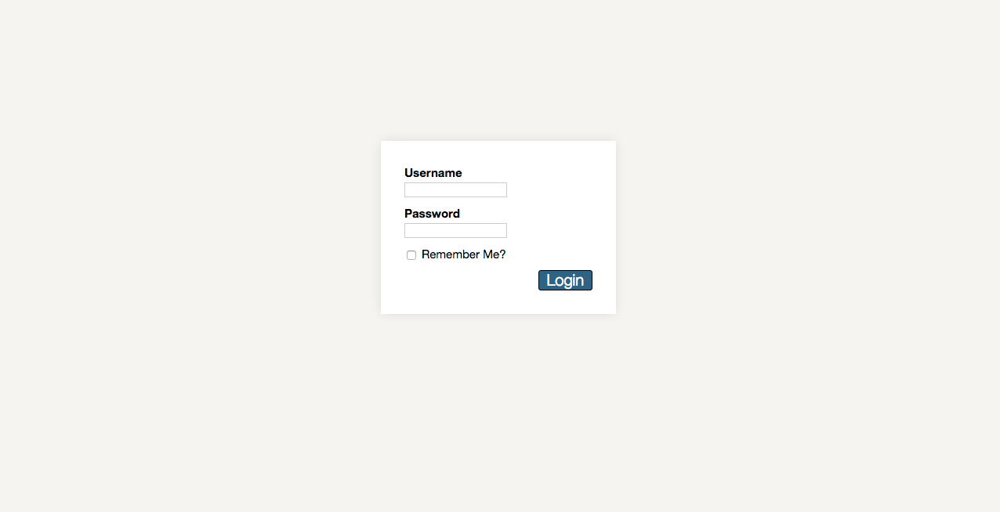

# Quiz App #

#### Written in vanilla JavaScript, Handlebars, and HTML/CSS.

This application requires a web server for it to be functional. 

### Features: ###

* A quiz application that allows you to write in your questions into a JSON file. 
* You can pick between multiple-choice, fill-in-the-blank, and drag-and-drop questions. 
* Supports multiple users. Stores username/password in localStorage and remembers last user via cookie.

### Future Updates: ###

* Will include a title screen and an "admin" mode where a user can submit his/her questions into the app without writing directly into the JSON file.
* Will include a score screen where a list of users and their respective scores can be viewed.

###### Screenshots

